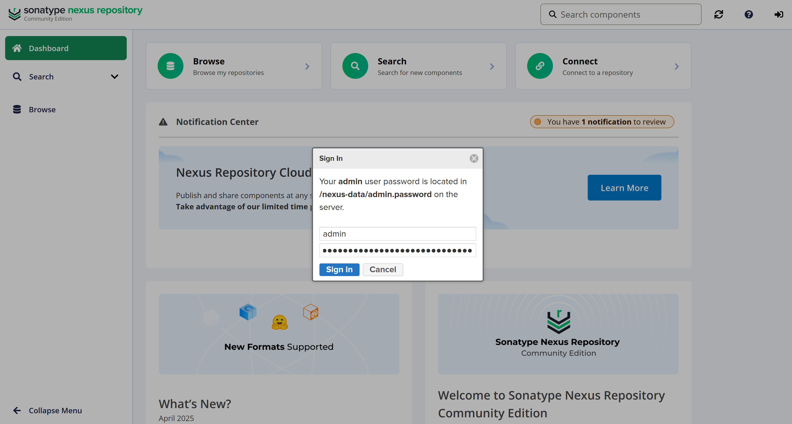
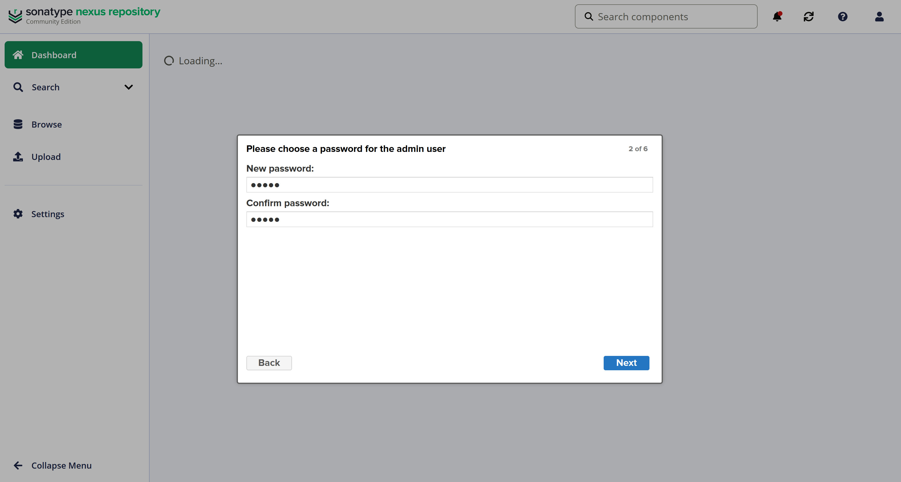
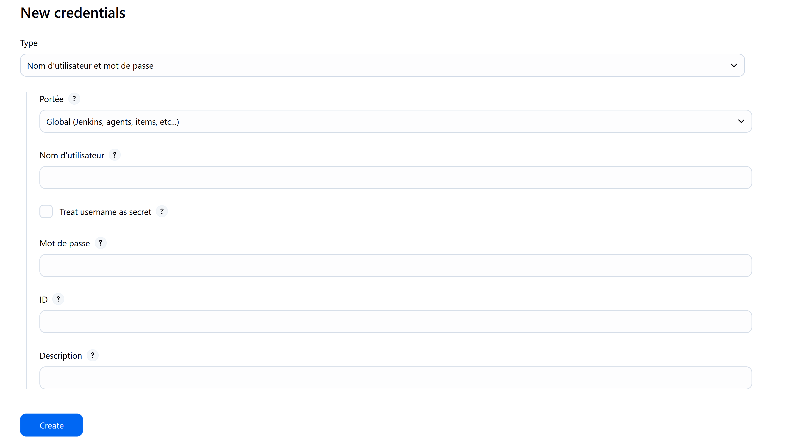
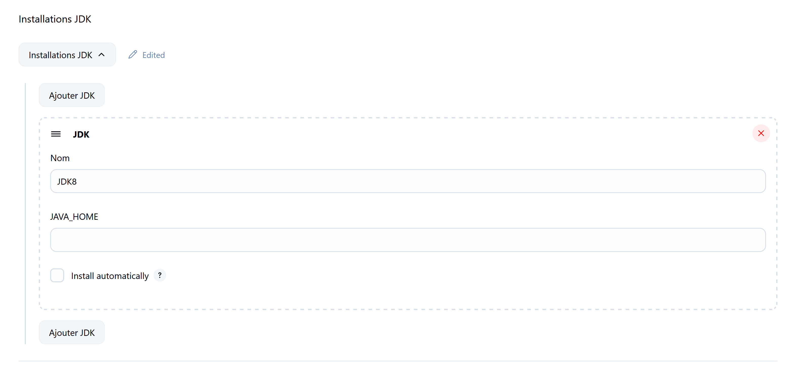
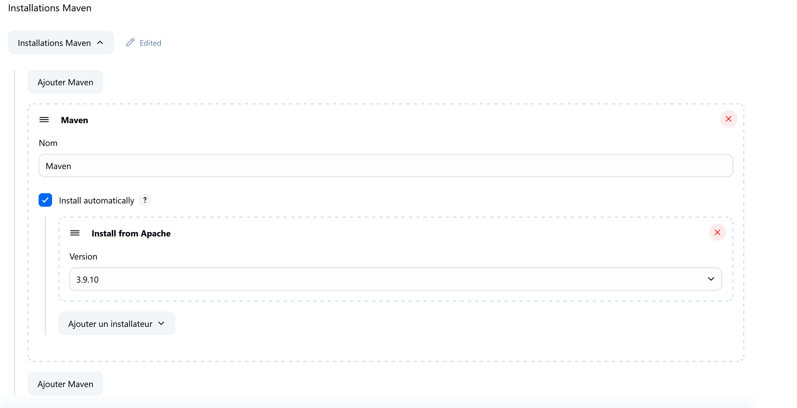
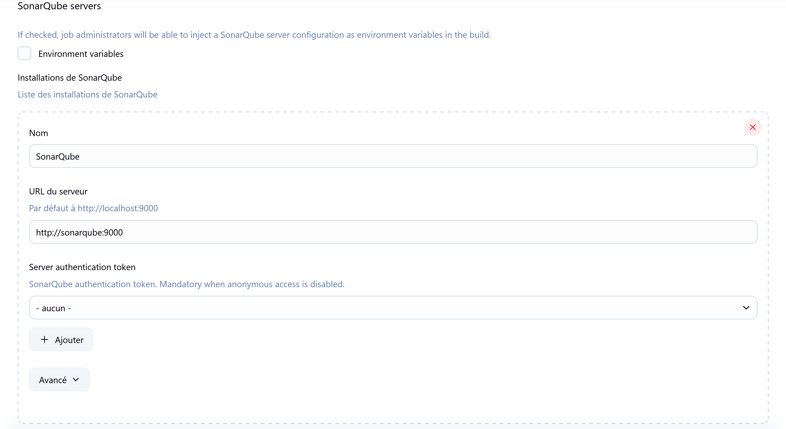
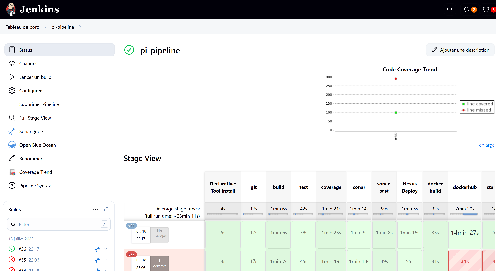
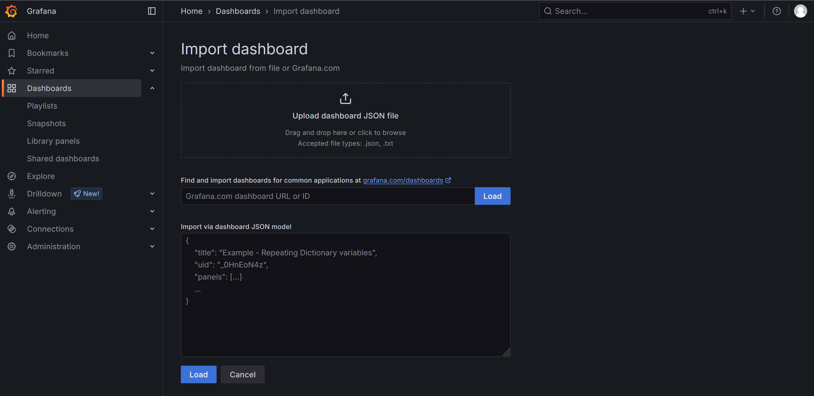

# 🚀 Project Setup Guide

📌 **Important** : Do not change the root folder name (`pi`).

---

## ✅ Default Credentials

| Tool | Username | Password |
|------|----------|----------|
| Grafana | `admin` | `admin@123` |
| Nexus | `admin` | *see step below* |

---

## ⚙️ Requirements

- Linux (WSL or machine locale)
- Docker & Docker Compose installés

---

## 1️⃣ Clone and Project Setup

```bash
git clone https://github.com/chyrazz/pi.git
cd pi
rm -rf .git
git init
git remote add origin https://github.com/votre-username/votre-repo.git
git add .
git commit -m "Initial commit"
git branch -M main
git push -u origin main

```

## **2️⃣ Start the Containers**

```bash
docker compose up -d jenkins sonarqube nexus grafana prometheus

```

## **3️⃣ Nexus Configuration**

- Retrieve the initial password: :

```bash
docker exec -it nexus bash
cat /nexus-data/admin.password
```
- Go to [http://localhost:8081](http://localhost:8081)
- Login with:  
  - Username: `admin`
  - Password: (the one retrieved above)
- Change the admin password to admin to simplify access (optional)





## **4️⃣ Jenkins Configuration**

- Go to [http://localhost:8080](http://localhost:8080)
- Add these Credentials: :  
  - Docker Hub : ID = `nexus-docker-credentials`  
  - SonarQube : ID = `sonar-credentials`
- Configure :  
  - JDK 8  
  - Maven (version recommandée : 3.9.x)
 


### Configure JDK and Maven in Jenkins

#### Add JDK

- Click **Manage Jenkins** → **Global Tool Configuration**  
- Scroll to **JDK**, click **Add JDK**  
- Enter name (e.g. `JDK 8`), check **Install automatically**, select JDK 8  
- Save  



#### Add Maven

- Scroll to **Maven**, click **Add Maven**  
- Enter name (e.g. `Maven 3.9.x`), check **Install automatically**, select version  
- Save  



## **5️⃣ Customize Docker Compose for Backend App**

- Open `docker-compose.yml`  
- Replace all occurrences of `chanzouti2001` with your Docker Hub username


## **6️⃣ SonarQube Configuration**

- Go to [http://localhost:9000](http://localhost:9000)
- Change the `admin` password to a secure password
- Create an access token: 
  - Go to **My Account** → **Security** → **Generate Tokens**
- Add this token inside `pom.xml` under the property `sonar.login`



## **7️⃣ Create a Jenkins Pipeline**

- In Jenkins, create a **Nouveau Item** → **Pipeline**  
- Configure the GitHub source with your repository  
- Use the Jenkinsfile present in your repo  
- Start a build (**Build Now**)



## **8️⃣ Grafana Dashboards**

- After the first build, access Grafana: [http://localhost:3000](http://localhost:3000)  
- Login:
  - Username : `admin`  
  - Password : `admin@123`  
- Import the following Grafana dashboards via Dashboard IDs (Menu Import > Dashboard IDs):  

| Dashboard ID | Description (exemple)                |
|--------------|------------------------------------|
| 9964         | Kubernetes cluster monitoring       |
| 4701         | Jenkins build statistics            |
| 11378        | Docker container metrics            |
| 16459        | Prometheus server overview          |
| 1860         | Node Exporter server metrics        |
| 8321         | SonarQube quality gates             |
| 17642        | System CPU and Memory monitoring    |


